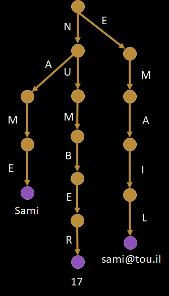
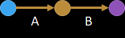
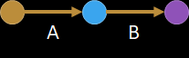
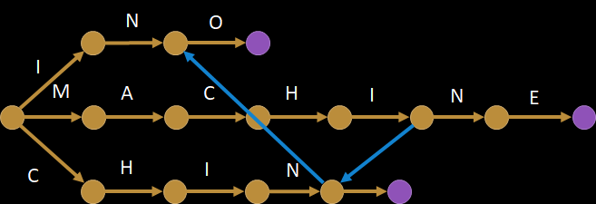

import { CodeSurfer } from "mdx-deck-code-surfer"
import { Split } from 'mdx-deck/layouts'
export { dark as theme } from 'mdx-deck/themes'

# String replacements

Coding Interview Exercise

---

## Problem

- Multiple search and replace in string:

```clike
string ReplaceAll(
    string text,
    (string, string)[] replacements
);
```

- Frequent questions:
  - Overlaps e.g. `NAME` & `LASTNAME`
  - Known delimiters e.g. `{{NAME}}`

---

import snippetBasic from 'raw-loader!./snippets/basic.cs';

<CodeSurfer
  title="Straightforward solution"
  code={snippetBasic}
  lang="clike"
  showNumbers={false}
  dark={true}
  steps={[
    { },
    { lines: [1], notes: "About API: many candidates will use a hash map"},
    { tokens: { 4: [0, 1, 2, 3, 4] }, notes: "About memory: string reallocation" },
    { tokens: { 4: [2, 3, 4, 5, 6, 7, 8, 9] }, notes: "About I/Os: seeking in large strings" },
    { range: [3, 4], notes: "About performance: O(n*m) complexity" },
    { }
  ]}
/>

---

## Possible follow-ups

- Memory:
  - In-place replacements (dead end)
- I/O:
  - Forward-only streaming (transitional)
- Performance:
  - Text pre-processing (Knuth-Morris-Pratt)
- All-in-one:
  - Pattern pre-processing (many solutions)

---

## Text pre-processing

- Often suggested by candidates
  - Common solution: split by "word"
  - Variant: introduce delimiters e.g. `$TOKEN`
- Can open discussions:
  - Iterate over tokens without copying them
  - Hash map lookups without cloning keys
- KMP doesn't fit an 1 hour interview
- Not worth spending time here otherwise

---

## Forward-only streaming 1/2

- New constraint:
  - Replacements in gigabytes strings
- What would break:
  - Seeking & reloading from disk
  - Storing temporary result
- Hint for candidate:
  - Read every character only once?

---

import snippetStream from 'raw-loader!./snippets/stream.py';

<CodeSurfer
  title="Forward-only streaming 2/2"
  code={snippetStream}
  lang="python"
  showNumbers={false}
  dark={true}
  steps={[
    { },
    { range: [2, 5], notes: "Prepare matching window with first characters from string" },
    { lines: [7], notes: "Use placeholders to match tokens at end of string" },
    { range: [9, 25], notes: "Outer loop now iterates over text, inner loop over search strings" },
    { notes: "...but still O(n*m) complexity!" }
  ]}
/>

---

## Pattern pre-processing

- New constraint:
  - Replacements list has lots of entries
- What would break:
  - Our O(n*m) complexity would hurt
- Hint for candidate:
  - Factorize redundant searches?

---

## Factorize lookups using tries

<table width="100%">
    <tr>
        <td>
            <p>NAME &raquo; Sami</p>
            <p>NUMBER &raquo; 17</p>
            <p>EMAIL &raquo; sami@tou.il</p>
        </td>
        <td>
            
        </td>
    </tr>
</table>

---

## Addressing ambiguities

- Input text: `"AAB"`, replacement: `"AB"` &raquo; `"X"`

Input | Pointer in tree
---|---
<code><u>&nbsp;</u>AAB</code> | 
<code>&nbsp;<u>A</u>AB</code> | 
<code>&nbsp;A<u>A</u>B</code> | 
<code>&nbsp;AA<u>B</u></code> | 

---

## Aho-Corasick

- Fallback to longest suffix on failure
- Example with MACHINE, CHINA & INO:



---

## Boyer-Moore 1/3

Pattern | `AAAAAA`
---|---
Subject | `BBBBBBBBBB`
Start at | <code>BBBBB<u>B</u>BBBB</code>

---

## Boyer-Moore 2/3

Action | Result
---|---
Search <code>WIKIPEDIA</code> in | <code>ENCYCLOPEDIA</code>
Test offset `len("WIKIPEDIA") - 1` | <code>--------<u>E</u>DIA</code>
Possible candidate | <code>---<em>WIKIP</em><u>E</u>DIA</code>?

---

## Boyer-Moore 3/3

WIKIPEDIA

Character | Jump offset
---|---
I | 1
D | 2
E | 3
P | 4
K | 6
W | 8
Any other character | 9

---
