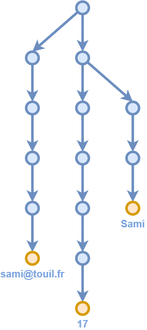

import Box from "superbox"
import { CodeSurfer } from "mdx-deck-code-surfer"
import { Split } from "mdx-deck/layouts"
import { dark } from "mdx-deck/themes"
import { Notes } from "mdx-deck"
export { components } from "mdx-deck-code-surfer"
import vsDark from "prism-react-renderer/themes/vsDark"

export const theme = {
  ...dark,
  codeSurfer: {
    ...vsDark,
    showNumbers: false
  }
}

# String replacements

Coding Interview Exercise

---

## 💢 Problem

- Multiple search and replace in string:

<Box align="left">
  <code>
    string ReplaceAll(<br />
    &nbsp;&nbsp;&nbsp;&nbsp;string text,<br />
    &nbsp;&nbsp;&nbsp;&nbsp;IEnumerable&lt;(string, string)&gt; replacements<br />
    );
  </code>
</Box>

- Frequent questions:
  - Overlaps e.g. `NAME` & `LASTNAME`?
  - Known delimiters e.g. `$NAME`?
  - Are regular expressions OK?

---

## 📍 Your score is 2.0

(everyone needs a baseline)

---

```clike
// Our very first solution

string ReplaceAll(string text,
    IEnumerable<(string, string)> replacements)
{
    foreach (var (search, replace) in replacements)
        text = text.Replace(search, replace);
 
    return text;
}
----
* > Should be done in less than 5 minutes, then discuss...
4 > ...about API: many candidates will use a hash map
7[0:4] > ...about memory: multiple string reallocations
7[2:9] > ...about I/Os: seeking across large ranges
6:8 > ...about performance: O(n*m) complexity
```

---

## 💭 Possible follow-ups

- Memory:
  - In-place replacements
- I/O:
  - Forward-only streaming
- Performance:
  - Subject pre-processing
- All-in-one:
  - Search pre-processing

```notes
Memory: deadend, I/O: transitional, Performance: Knuth-Morris-Pratt, All-in-one: many solutions.
```

---

## 📍 Your score is ~2.5

(depending on discussion)

---

## 📑 Subject pre-processing

- Split by word or introduce `$TOKEN` delimiters
- Knuth-Morris-Pratt doesn't fit 1h interview
- Can open hash map usage discussions
- Not worth spending time here otherwise

```notes
Split by word often suggested by candidates. Hash map discussions: lookups without cloning keys?
```

---

## ➡️ Forward-only streaming

- Replacements in gigabytes strings
- What would break?
- How to workaround it?

_Hint: replace everything in one pass_

```notes
Suggest as an extension to candidates, ask what would break (seeking & reloading from disk, storing temporary results), hint about reading characters one by one. Essentially swapping the two loops.
```

---

```python
# Forward-only streaming

def replace_all(text, text_length, replacements):
    buffer_length = max((len(search) for search, _ in replacements))
    buffer = [text.read(1) for i in range(buffer_length)]

    source_length = text_length + buffer_length
    source = (text.read(1) or '\\0' for i in range(source_length))

    for next_character in source:
        match = None

        for (search, replace) in replacements:
            if "".join(buffer[0:len(search)]) == search:
                match = (len(search), replace)

        if match is None:
            match = (1, buffer[0])

        sys.stdout.write(match[1])

        buffer = \\
            buffer[match[0]:] + \\
            [next_character] + \\
            [next(source) for i in range(match[0] - 1)]
----
*
4:5 > Prepare matching buffer of N characters (N = longuest search string)
7:8 > Prepare source buffer with text characters + some extra to match at end of string
10 > Outer loop iterates only once over source characters
11:15 > Inner loop searches for a match and stores length + replacement value
17:18 > Handle \"no match\" as a 1-character match replaced by itself
20 > Output our best match
22:25 > Shift matching buffer by the number of matched characters
* > ...but complexity is still O(n*m)!
```

---

## 📍️ Your score is ~3.0

(depending on autonomy)

---

## 🔦 Search pre-processing

- Replacements list has lots of entries
- Our O(n*m) complexity would hurt
- How to improve it?

_Hint: `quantity` & `quartile`_

```notes
Ask candidates how to factorize redundant searches.
```

---

## 🌴 Factorize lookups using tries

<table width="100%">
    <tr>
        <td>
            <p>NAME &raquo; Sami</p>
            <p>NUMBER &raquo; 17</p>
            <p>EMAIL &raquo; sami@tou.il</p>
        </td>
        <td>
            
        </td>
    </tr>
</table>

---

```javascript
// Using a trie

const replace_all = (text, root) => {
  let current = root;
  let pending = "";

  for (let character of text) {
    pending += character;

    const next = current[character];

    if (next === undefined) {
      process.stdout.write(pending);

      current = root;
      pending = "";
    } else if (next.value === undefined) {
      current = next;
    } else {
      process.stdout.write(next.value);

      current = root;
      pending = "";
    }
  }
}
----
*
4:5 > Initialize cursor at root node
7:10 > Iterate over text, save character and move to child node
10:16 > Option 1: invalid transition, flush buffer and reset cursor
10:18 > Option 2: valid transition but no replacement yet, move cursor
10:24 > Option 3: replacement found, print it and reset cursor + buffer
* > ...but we're not there yet! 🐞
```

```notes
Options 1 and 3 have redundant code. Demo if possible.
```

---

## 🔀 Addressing ambiguities

Input text: `"AAB"`, replacement: `"AB"` &raquo; `"X"`

Input | Pointer in tree
---|---
<code><u>&nbsp;</u>AAB</code> | 
<code>&nbsp;<u>A</u>AB</code> | 
<code>&nbsp;A<u>A</u>B</code> | 
<code>&nbsp;AA<u>B</u></code> | 

```notes
Can be solved with backtracking or multiple cursors.
```

---

## 🛣️ Backtracking is costly

Action | Result
---|---
Search | `CHINA`, `MACHINE`
Subject | <code>MACHINA</code>
Match [0:5] | `MACHIN`<code>A</code>
Action | Backtrack 5 characters? 😢

---

## ⛑️ Aho-Corasick to the rescue

- Fallback to longest suffix on failure
- Example with MACHINE, CHINA & INOVATE


---

```javascript
// Build fallback connections for Aho-Corasick algorithm

void BuildFallbacksForNode(Node parent, string prefix)
{
    foreach (KeyValuePair<char, Node> pair in parent.ChildNodes)
    {
        var node = pair.Value;
        var path = prefix + pair.Key;

        for (var i = 1; i <= path.Length; ++i)
        {
            if (TryFindNode(path.Substring(i), out var fallback))
            {
                node.FallbackDrop = path.Substring(0, i);
                node.FallbackNode = fallback;

                break;
            }
        }

        BuildFallbacksForNode(pair.Value, path);
    }
}

BuildFallbacksForNode(RootNode, string.Empty);
----
*
3 > parent = node at "MACHI", prefix = "MACHI"
5:8 > Process all possible transitions from parent node, e.g. "N"
10:13, 18:19 > Search for "MACHIN", "ACHIN", "CHIN", "HIN", "IN" and "N" in tree
14:17 > Connect "CHIN" to fallback node while dropping prefix "MA"
21 > Repeat for every child node of current one
* > Invoke on root node and our fallback graph is complete!
```

```notes
Process parent node. For each child node matching given string, search for longuest possible match in the tree that ends with current string. Longuest suffix guarantees it's safe to drop prefix characters.
```

---

## 🔎 Why reading everything?

Action | Result
---|---
Search | `AAAAAA`
Subject | `BBBBBBBBBB`
Jump at offset 5 | <code>-----<u>B</u>BBBB</code>

---

## 🏃 Boyer-Moore

Action | Result
---|---
Search <code>WIKIPEDIA</code> in | <code>ENCYCLOPEDIA</code>
Test offset `len("WIKIPEDIA") - 1` | <code>--------<u>E</u>DIA</code>
Possible candidate | <code>---<em>WIKIP</em><u>E</u>DIA</code>?

⬇️

Character | I | D | E | P | K | W | Any other
---|---|---|---|---|---|---|---
Jump distance | 1 | 2 | 3 | 4 | 6 | 8 | 9

---

## 🎡 Rabin-Karp

👷 FIXME

---

## 📍️ Your score is ~4.0

(depending on topics covered)

---

## 🌌 Going further

- Combining multiple algorithms
- Globbing and regular expressions

```notes
grep uses Aho-Corasick & Boyer-Moore.
```

---

## 🚦 Ready?

```notes
Shadow, reverse-shadow, chat about interviews.
```