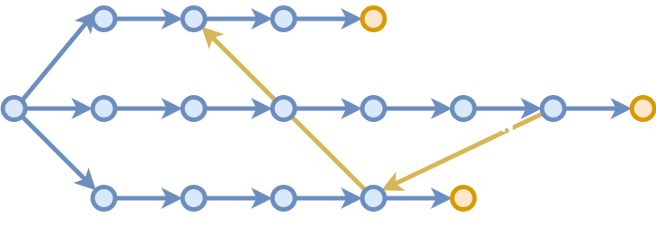

import { CodeSurfer } from "mdx-deck-code-surfer"
import { Split } from "mdx-deck/layouts"
import { dark } from "mdx-deck/themes"
import { Notes } from "mdx-deck"
export { components } from "mdx-deck-code-surfer"
import vsDark from "prism-react-renderer/themes/vsDark"

export const theme = {
  ...dark,
  codeSurfer: {
    ...vsDark,
    showNumbers: false
  }
}

# String replacements

Coding Interview Exercise

---

import Box from 'superbox'

## 💢 Problem

- Multiple search and replace in string:

<Box align="left">
  <code>
    string ReplaceAll(<br />
    &nbsp;&nbsp;&nbsp;&nbsp;string text,<br />
    &nbsp;&nbsp;&nbsp;&nbsp;IEnumerable&lt;(string, string)&gt; replacements<br />
    );
  </code>
</Box>

- Frequent questions:
  - Overlaps e.g. `NAME` & `LASTNAME`
  - Known delimiters e.g. `{{NAME}}`

---

```clike
// Our very first solution

string ReplaceAll(string text,
    IEnumerable<(string, string)> replacements)
{
    foreach (var (search, replace) in replacements)
        text = text.Replace(search, replace);
 
    return text;
}
----
* > Should be done in less than 5 minutes, then discuss...
4 > ...about API: many candidates will use a hash map
7[0:4] > ...about memory: multiple string reallocations
7[2:9] > ...about I/Os: seeking across large ranges
6:8 > ...about performance: O(n*m) complexity
```

---

## 💭 Possible follow-ups

- Memory:
  - In-place replacements (dead end)
- I/O:
  - Forward-only streaming (transitional)
- Performance:
  - Text pre-processing (Knuth-Morris-Pratt)
- All-in-one:
  - Pattern pre-processing (many solutions)

---

## 📍 Your score is ~2.5

(depending on discussion)

---

## 📑 Text pre-processing

- Often suggested by candidates
  - Common solution: split by "word"
  - Variant: introduce delimiters e.g. `$TOKEN`
- Can open discussions:
  - Iterate over tokens without copying them
  - Hash map lookups without cloning keys
- KMP doesn't fit an 1 hour interview
- Not worth spending time here otherwise

---

## ➡️ Forward-only streaming

- New constraint:
  - Replacements in gigabytes strings
- What would break:
  - Seeking & reloading from disk
  - Storing temporary result
- Hint for candidate:
  - Read every character only once?

---

```python
# Forward-only streaming

def replace_all(text, text_length, replacements):
    buffer_length = max((len(search) for search, _ in replacements))
    buffer = [text.read(1) for i in range(buffer_length)]

    source_length = text_length + buffer_length
    source = (text.read(1) or '\\0' for i in range(source_length))

    for next_character in source:
        match = None

        for (search, replace) in replacements:
            if "".join(buffer[0:len(search)]) == search:
                match = (len(search), replace)

        if match is None:
            match = (1, buffer[0])

        sys.stdout.write(match[1])

        buffer = \\
            buffer[match[0]:] + \\
            [next_character] + \\
            [next(source) for i in range(match[0] - 1)]
----
*
4:5 > Prepare matching buffer of N characters (N = longuest search string)
7:8 > Prepare source buffer with text characters + some extra to match at end of string
10 > Outer loop iterates only once over source characters
11:15 > Inner loop searches for a match and stores length + replacement value
17:18 > Handle \"no match\" as a 1-character match replaced by itself
20 > Output our best match
22:25 > Shift matching buffer by the number of matched characters
* > ...but complexity is still O(n*m)!
```

```notes
Test
```

---

## 📍️ Your score is ~3.0

(depending on autonomy)

---

## 🔎 Pattern pre-processing

- New constraint:
  - Replacements list has lots of entries
- What would break:
  - Our O(n*m) complexity would hurt
- Hint for candidate:
  - Factorize redundant searches?

---

## 🌴 Factorize lookups using tries

<table width="100%">
    <tr>
        <td>
            <p>NAME &raquo; Sami</p>
            <p>NUMBER &raquo; 17</p>
            <p>EMAIL &raquo; sami@tou.il</p>
        </td>
        <td>
            
        </td>
    </tr>
</table>

---

```js
// Using a trie

const replace_all = (text, root) => {
  let current = root;
  let pending = "";

  for (let character of text) {
    pending += character;

    const next = current[character];

    if (next === undefined) {
      process.stdout.write(pending);

      current = root;
      pending = "";
    } else if (next.value === undefined) {
      current = next;
    } else {
      process.stdout.write(next.value);

      current = root;
      pending = "";
    }
  }
}

replace_all("abcdef", {
  "a": { "b": { "value": "x" } },
  "e": { "f": { "value": "y" } }
});
----
*
4:5 > Initialize cursor at root node
7:10 > Iterate over text, save character and move to child node
10:16 > Option 1: invalid transition, flush buffer and reset cursor
10:18 > Option 2: valid transition but no replacement yet, move cursor
10:24 > Option 3: replacement found, print it and reset cursor + buffer
* > ...but we're not there yet! 🐞
```

---

## 🔀 Addressing ambiguities

Input text: `"AAB"`, replacement: `"AB"` &raquo; `"X"`

Input | Pointer in tree
---|---
<code><u>&nbsp;</u>AAB</code> | 
<code>&nbsp;<u>A</u>AB</code> | 
<code>&nbsp;A<u>A</u>B</code> | 
<code>&nbsp;AA<u>B</u></code> | 

---

## ⛑️ Aho-Corasick

- Fallback to longest suffix on failure
- Example with MACHINE, CHINA & INO:



---

## ⏩ Boyer-Moore 1/3

Pattern | `AAAAAA`
---|---
Subject | `BBBBBBBBBB`
Start at | <code>BBBBB<u>B</u>BBBB</code>

---

## ⏩ Boyer-Moore 2/3

Action | Result
---|---
Search <code>WIKIPEDIA</code> in | <code>ENCYCLOPEDIA</code>
Test offset `len("WIKIPEDIA") - 1` | <code>--------<u>E</u>DIA</code>
Possible candidate | <code>---<em>WIKIP</em><u>E</u>DIA</code>?

---

## ⏩ Boyer-Moore 3/3

WIKIPEDIA

Character | Jump offset
---|---
I | 1
D | 2
E | 3
P | 4
K | 6
W | 8
Any other character | 9

---

## 🎡 Rabin-Karp
